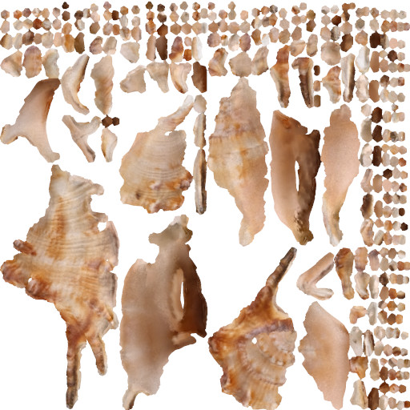
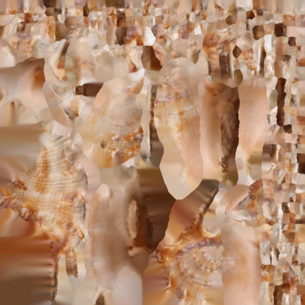

# Flood

### This is Flood. It's purpose is to fill empty spaces in textures and alike.

## Motivation

Unlike [Meshlab](https://www.meshlab.net/), which does a great job at filling unused spaces in textures, [blender](https://www.blender.org/) only focuses on getting a certain amount of border pixels right.

> Why is this important?

There are reasons, why one might want to have a texture filled completely even the unused areas.

1. In some cases, depending on the resolution and the viewer angle, texture coordinate calculations may be a bit off, effectively requesting pixels that are not part of the texture. This is a question of precision and web- or game-engines are known to mess this up for performance reasons.  
Therefore it might be a good idea to have the unused parts of you texture visually as close to the _real_ texture as possible.
2. When exporting a texture as `.jpg` these borders introduce regions of extreme contrast, as the texture island suddenly ends in black or white.  
The compression will focus on keeping these artificial border as good as possible and we'll lose details of the texture close to to border instead.  
In some cases it will also introduce strong compression artefacts.

Flood solves these two problems by analysing the border pixels and repeatedly filling unused pixels with the mean value of the surrounding border pixels.  
This process extends the borders by one pixel for each iteration until there are no more unset pixels to be found.

The reason for me to write this piece of code is that I didn't find any comparable function in [gimp](https://www.gimp.org/) and I don't know about any other comparable free software which could do it.

## Example
### Here is an example of how this will look.

This is the original texture that blender created.  


This is how it looks like after flood has been applied.  


You may have noticed, that flood created some artificial regions of high contrast. These appear where the extended borders of neighbouring islands clash together.  
Effectively the algorithm creates an unintended [watershed transformation](https://en.wikipedia.org/wiki/Watershed_(image_processing)) here.  
In most cases these regions will be far away from the real texture so that the compression are-facts they create do not have an impact on the contents of the texture.  
Still I'm not too happy with it and I admire how Meshlab solves the problem.

## How to use

This is a command line binary and its usage is rather simple.

```
./flood <input.png> <output.png>
```

**Beware that `<output.png>` will be overwritten unconditionally.**

The input image needs to be `RGBA`. All regions without 100% opacity will be considered as those that need to be filled up.  
Besides that alpha values are not used in any way (, yet?).

I'm aware that non GUI applications are uncommon in the Windows world. I was aiming for the least effort solution that works for _me_.

## To compile, … or not to compile.

If you have [rust](https://www.rust-lang.org/) installed and know how to use it, it should be no big deal to compile it.

Hint: `cargo build`.

Since I'm into cross compiling I have provided binaries for the common big architectures in the [`./target`](./target) folder.  
You should be able to guess which one applies to you. If not, [here's a translation of these names](https://doc.rust-lang.org/nightly/rustc/platform-support.html). 

## Issues

- This is my first rust program and I probably did things in an unusual way.
- The algorithm is rather slow, so I made it use 4 threads to profit from todays multi core CPUs.
- The image dimensions should be even numbers in both directions, because I was to lazy to think of the extra case, where 2x half the size doesn't equal  the full size for integer numbers.
- Fitting the mean of the colors into 8-bit RGB over and over again eradicates all differences the farther we get from the real borders.
- Because I'm using a 3x3 neighbourhood the diagonals propagate faster. This leads to some weird unintended artefacts on larger images, where the border is repeated very often. (Did I mention that I admire Meshlabs solution?)

### Forks and Pull request are welcome!

## Credits

I've used the [PNG crate of rust](https://crates.io/crates/png) and parts of my image loading are a ripoff of their example code.